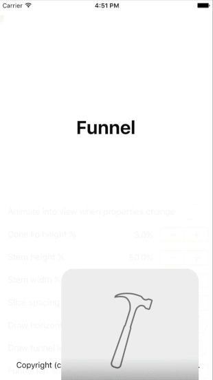

# Funnel

<!--[](https://travis-ci.org/Pierre-Yves Troel/Funnel)-->
[](http://cocoapods.org/pods/Funnel)
[](http://cocoapods.org/pods/Funnel)
[](http://cocoapods.org/pods/Funnel)

Funnel is a chart library to present information as a funnel, a typical usage scenario is sales pipelines in CRM products,



## Features

- [x] Easy to use and customize
- [x] All dimensions expressed as a percentage of width and height of the view
- [x] Customizable properties include:
- [x] Stem height and width
- [x] Cone lip height
- [x] Slice spacing
- [x] Horizontal lines, along with thickness and dash patterm
- [x] Left shadow
- [x] Labels width and shadows
- [x] Color palette

## Usage

To run the example project, clone the repo, and run `pod install` from the Example directory first.

## Requirements

- iOS 8.0+ / Mac OS X 10.9+ / tvOS 9.0+ / watchOS 2.0+
- Xcode 7.2+

## Installation

Funnel is available through [CocoaPods](http://cocoapods.org). To install
it, simply add the following line to your Podfile:

```ruby
pod "Funnel"
```

## Author

Pierre-Yves Troel, pyt@pyttroll.com

## License

Funnel is available under the MIT license. See the LICENSE file for more info.
